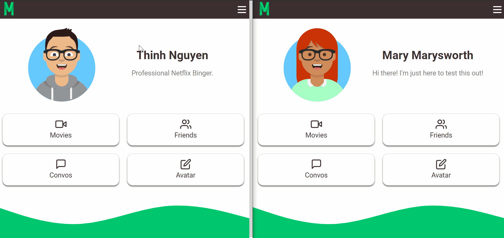

# WELCOME TO MUVISTACK

---

## ABOUT THE APPLICATION

This web app was created as my final project submission for Concordia's Full Stack Web Development Bootcamp.

The initial idea for the app was to provider users a platform to connect with each other based on their favourite movies and allow them to enter a real-time group chat upon matching with each other. Users within the group chat can also set up a date with each other to watch the movie seperately and continue discussing it in the chat!

---

## FEATURES

### CREATE YOUR OWN AVATAR

New users can create their own avatar using the amazing [API](https://getavataaars.com/) created by [Fang Pen Lin](https://github.com/fangpenlin/avataaars) and designed by [Pablo Stanley](https://twitter.com/pablostanley).

---

### GO THROUGH ALL YOUR FAVOURITE MOVIES

Powered by [TMDB's](https://www.themoviedb.org/) movie database API, users can browse a vast collection of movies based on an array of genres. Users can simply choose to like or not like a movie after going through a limited deck of movie cards.

---

### GET MATCHED IN REAL TIME WITH OTHER USERS

Users who are browsing can be matched in real time! They are prompted by a modal to enter their designated chat room which is created after two or more users match!

---

### REAL TIME MESSENGING

Matched users can discuss their movies together and set up dates to watch it at a specified time seperately! Using Firebase's RealTime database feature, the component can read chat data instantly to render.

